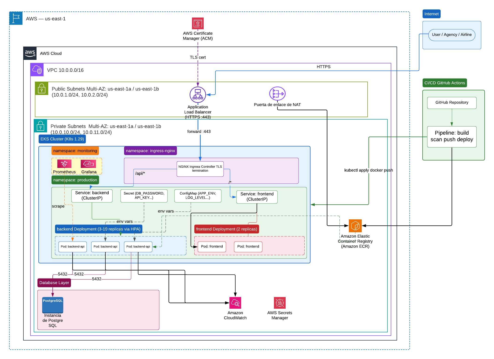

# Deal Engine — Diseño de Infraestructura DevOps/SRE

Diseño de arquitectura de despliegue para la plataforma de tickets de viaje de Deal Engine sobre Kubernetes.

---

## Supuestos del Diseño

| Supuesto | Decisión | Justificación |
|---|---|---|
| Cloud provider | **AWS** | Madurez de EKS, integración nativa con ECR, RDS, IAM |
| Clúster K8s | **EKS (managed)** | Control plane gestionado por AWS (SLA 99.95%), sin operación de etcd/master |
| CI/CD | **GitHub Actions** | Sin infraestructura adicional de CI, integración nativa con el repo |
| Container Registry | **ECR** | Nativo a AWS, IAM-based auth, sin credenciales adicionales |
| TLS | **cert-manager + Let's Encrypt** | Certificados gratuitos, renovación automática |
| Base de datos | **RDS PostgreSQL Multi-AZ** | Datos sensibles de pasajeros → necesita failover automático |
| Ingress | **NGINX Ingress Controller** | Más configurable que AWS ALB Ingress (rate limiting, headers, snippets) |
| Estrategia de deploy | **Rolling Update** | Sin costo de infraestructura doble; suficiente para un equipo pequeño |
| Observabilidad | **CloudWatch + Prometheus + Grafana** | CloudWatch nativo en AWS, Prometheus para métricas K8s |
| Equipo asumido | **3-5 personas** | Diseño simple y mantenible sobre diseño complejo |
| Tráfico base | **500 req/seg** pico, **1000 req/seg** estacional | Según especificación del reto |

---

## Arquitectura de Alto Nivel



Arquitectura de referencia para despliegue en AWS con EKS, RDS Multi-AZ, CI/CD y observabilidad.


---

## 1. Diseño de Kubernetes

### Namespaces

| Namespace | Propósito |
|---|---|
| `production` | Workloads de producción (frontend + backend) |
| `staging` | Workloads de staging — mismo diseño, menos réplicas |
| `monitoring` | Prometheus + Grafana |
| `ingress-nginx` | NGINX Ingress Controller |

La separación por namespace permite aplicar políticas de red, RBAC y quotas de recursos de forma independiente por ambiente.

### Backend API

- **Réplicas:** 3 mínimo (una por AZ), hasta 10 con HPA
- **Rolling Update:** `maxSurge=1, maxUnavailable=0` → zero-downtime deploy
- **Recursos:** CPU 250m-500m, Memory 256Mi-512Mi
- **HPA:** escala cuando CPU supera 70% — deja margen antes de saturar

```
k8s/backend/
├── deployment.yaml   # Deployment con securityContext, probes, resources
├── service.yaml      # ClusterIP — solo accesible dentro del cluster
├── hpa.yaml          # HorizontalPodAutoscaler (3-10 replicas)
└── configmap.yaml    # Variables no-sensibles (APP_ENV, DB_HOST, LOG_LEVEL...)
```

### Frontend

- **Réplicas:** 2 (sirve assets estáticos, bajo costo de CPU)
- Mismo patrón de seguridad: `runAsNonRoot`, `readOnlyRootFilesystem`

```
k8s/frontend/
├── deployment.yaml
└── service.yaml
```

### Ingress

```
k8s/ingress/ingress.yaml
```

- TLS con `cert-manager` (renovación automática de Let's Encrypt)
- Rate limiting: 100 req/seg por IP (protege la API de abuso)
- Headers de seguridad: `Strict-Transport-Security`, `X-Frame-Options`, `X-Content-Type-Options`
- Rutas: `/api/*` → backend, `/*` → frontend

### Secretos

```
k8s/secrets/secret.yaml  ← SOLO EJEMPLO, nunca commitear valores reales
```

**Estrategia en producción real:**
1. Los secretos se crean fuera del pipeline con `kubectl create secret generic` usando variables del CI
2. **Evolución recomendada:** AWS Secrets Manager + [External Secrets Operator](https://external-secrets.io/) — el operador sincroniza automáticamente los secretos al cluster

**Por qué no Vault para este contexto:** Vault requiere operación adicional (HA, unseal, backups). Con un equipo pequeño, AWS Secrets Manager es suficiente y reduce la carga operacional.

---

## 2. Red y Seguridad

### Diseño de VPC

```
VPC: 10.0.0.0/16
  ├── Subnets Públicas (us-east-1a, us-east-1b)
  │     ├── 10.0.1.0/24  → ALB, NAT Gateway
  │     └── 10.0.2.0/24  → ALB (multi-AZ para HA)
  └── Subnets Privadas (us-east-1a, us-east-1b)
        ├── 10.0.10.0/24 → EKS Worker Nodes, RDS
        └── 10.0.11.0/24 → EKS Worker Nodes, RDS (standby)
```

**Por qué:** Los pods nunca tienen IP pública. El ALB es el único punto de entrada desde internet. RDS tampoco es accesible desde afuera.

### Security Groups

| Recurso | Inbound | Outbound |
|---|---|---|
| ALB | 443 desde 0.0.0.0/0 | 8080 hacia EKS nodes |
| EKS Nodes | 8080 desde ALB SG | 5432 hacia RDS SG, 443 hacia internet (ECR, AWS APIs) |
| RDS | 5432 desde EKS Nodes SG | Ninguno |

### Network Policies K8s

```
k8s/network-policies/
├── deny-all.yaml        # Default deny todo — principio de mínimo privilegio
└── allow-traffic.yaml   # Abre solo: Ingress→FE, Ingress→BE, BE→RDS, Prometheus→BE
```

### Acceso administrativo al cluster

- `kubectl` solo via **AWS IAM + aws-auth ConfigMap**
- No hay acceso SSH a los nodos worker
- Para debugging: `kubectl exec` con permisos RBAC restringidos por rol
- Kubeconfig del CI/CD usa un **IAM Role** específico con permisos mínimos (solo `kubectl set image` y `rollout status`)

---

## 3. CI/CD

```
.github/workflows/ci-cd.yml
```

### Flujo completo

```
push → [validate] → [test] → [security-scan] → [build-push] → [deploy-staging] → [gate manual] → [deploy-production]
                                                                                          ↑
                                                                               Aprobación en GitHub
```

| Job | Descripción |
|---|---|
| `validate` | Lint YAML + validación de manifiestos K8s con `kubeval` |
| `test` | Pruebas unitarias con `pytest`, cobertura mínima del 80% |
| `security-scan` | Trivy escanea la imagen — falla si hay CVE CRITICAL/HIGH |
| `build-push` | Build + push a ECR con tag `git-sha` y `latest` |
| `deploy-staging` | Rolling update en namespace `staging` + smoke test HTTP |
| `deploy-production` | Requiere **aprobación manual** en GitHub Environments |
| `rollback` | `kubectl rollout undo` — se activa manualmente desde la UI |

### Trade-offs de la estrategia de deploy

| Estrategia | Ventaja | Desventaja | Decisión |
|---|---|---|---|
| **Rolling Update** ✅ | Simple, zero-downtime, sin infraestructura extra | No permite probar 100% del tráfico en la versión nueva antes | **Elegida** — apropiada para equipo pequeño |
| Blue/Green | Rollback instantáneo, 100% del tráfico switch | Doble infraestructura, más costo | Recomendada si el presupuesto lo permite |
| Canary | Libera gradualmente (5% → 25% → 100%) | Requiere Argo Rollouts o Istio, más complejidad | Para cuando el equipo crezca |

### Ambientes

- **staging branch** → deploy automático a `staging` namespace
- **main branch** → deploy automático a `staging` + gate manual para `production`
- Los PRs solo ejecutan `validate + test + security-scan` (sin deploy)

---

## 4. Seguridad

### Gestión de secretos

- Los `Secret` de Kubernetes **no se commitean con valores reales**
- En CI/CD: los secretos se inyectan desde **GitHub Actions Secrets** como variables de entorno
- Próximo paso: [External Secrets Operator](https://external-secrets.io/) + AWS Secrets Manager

### Seguridad de la imagen

- Imagen base: `python:3.12-alpine` (mínima superficie de ataque)
- Trivy escanea en cada pipeline — el build **falla** si hay vulnerabilidades CRITICAL
- Las imágenes se firman con el SHA del commit (trazabilidad)
- `USER nobody` en el Dockerfile (nunca corre como root)

### Pod Security (en cada Deployment)

```yaml
securityContext:
  runAsNonRoot: true          # No puede ser root
  runAsUser: 1000
  readOnlyRootFilesystem: true  # No puede escribir en el filesystem
  allowPrivilegeEscalation: false
  capabilities:
    drop: [ALL]               # Elimina todos los Linux capabilities
```

### Hardening básico

- Network Policies con **default-deny** (ningún pod habla con otro sin permiso explícito)
- RBAC: el service account del CI tiene solo los permisos necesarios para deploy
- Secrets encriptados en etcd (EKS habilita esto por defecto con AWS KMS)
- ALB termina TLS — el tráfico interno dentro del VPC va en HTTP (tradeoff de performance vs. complejidad)

---

## 5. Observabilidad y Confiabilidad

### Logs

- Los pods loggean en formato **JSON estructurado** a stdout/stderr
- EKS envía los logs a **CloudWatch Logs** via Fluent Bit (DaemonSet)
- Log groups: `/eks/deal-engine/production/backend-api`, `/eks/deal-engine/production/frontend`

### Métricas

- **Prometheus** scraping en `namespace: monitoring` → métricas de pods, HPA, nodos
- **Grafana** dashboards para: latencia p95, error rate, réplicas activas, uso de CPU/memoria
- CloudWatch custom metrics para RDS y ALB

### Health Checks

Cada pod expone dos endpoints:
- `/health` → liveness probe (¿está vivo el proceso?)
- `/ready` → readiness probe (¿puede recibir tráfico?) — verifica conexión a DB

### SLOs Propuestos

| SLO | Objetivo | Ventana |
|---|---|---|
| Disponibilidad | ≥ 99.9% (43 min downtime/mes) | 30 días rolling |
| Latencia p95 | < 300ms | 5 minutos |
| Error rate (5xx) | < 0.1% | 5 minutos |

**Alertas mínimas:**
- Error rate > 1% por 5 minutos → PagerDuty
- Latencia p95 > 500ms por 10 minutos → Slack
- Pod restarts > 5 en 10 minutos → Slack

---

## Estructura del Repositorio

```
deal-engine-devops/
├── README.md                          ← Este archivo
├── architecture/
│   └── diagram.mmd                    ← Diagrama Mermaid (renderiza en GitHub)
├── k8s/
│   ├── namespaces.yaml
│   ├── backend/
│   │   ├── deployment.yaml
│   │   ├── service.yaml
│   │   ├── hpa.yaml
│   │   └── configmap.yaml
│   ├── frontend/
│   │   ├── deployment.yaml
│   │   └── service.yaml
│   ├── ingress/
│   │   └── ingress.yaml
│   ├── secrets/
│   │   └── secret.yaml               ← Solo estructura, sin valores reales
│   └── network-policies/
│       ├── deny-all.yaml
│       └── allow-traffic.yaml
└── .github/
    └── workflows/
        └── ci-cd.yml
```

---

## Qué haría diferente con más tiempo

1. **Terraform para la infraestructura de AWS** — VPC, EKS, RDS, ECR como código (Infrastructure as Code)
2. **Argo Rollouts** para canary deployments — liberar el 5% del tráfico primero
3. **External Secrets Operator + AWS Secrets Manager** — secretos centralizados y rotación automática
4. **OWASP ZAP** en el pipeline — escaneo DAST de la aplicación en staging
5. **Cluster Autoscaler** para los nodos EKS — no solo los pods, también los nodos escalan
6. **PodDisruptionBudget** — garantiza que durante mantenimiento siempre haya mínimo 2 pods del backend disponibles

---

## Autor

Luis Angel Ortiz Ramos — [@luisortiz](https://github.com/luisortiz)  
Candidato DevOps Jr | Deal Engine Interview Challenge
